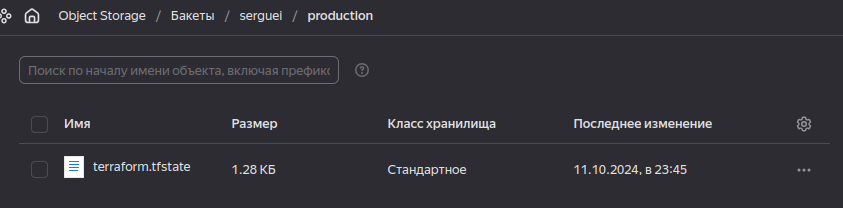
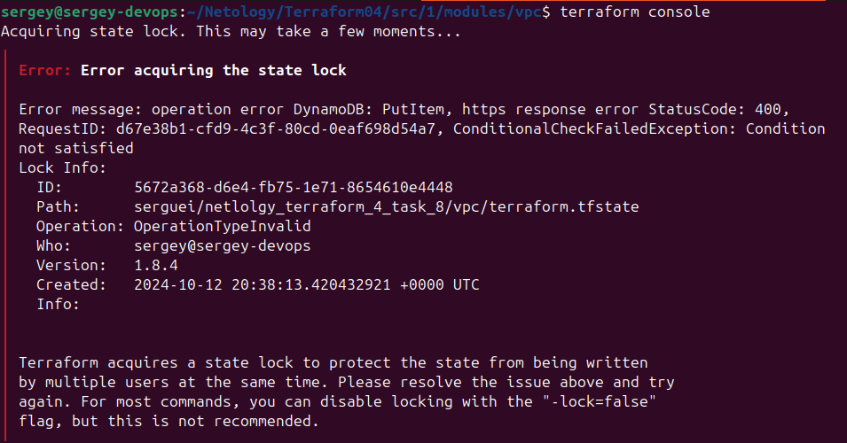
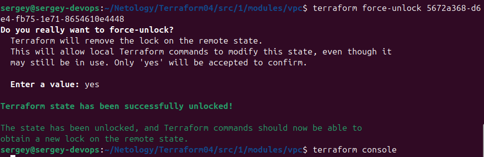

[Задание](https://github.com/netology-code/ter-homeworks/blob/main/05/hw-05.md)

## [Задание 1](tasks/task1.md)

### Типы ошибок:
#### tflint
- **terraform_required_providers
 Missing version constraint for provider "yandex" in `required_providers`**  
Не указана версия провайдера. Это чревато тем, что между версиями могут быть изменения, которые вызовут проблемы с кодом для текущей версии.
- **terraform_unused_declarations**  
В целях "очищения кода" tflint указывает на неиспользуемые переменные.

#### checkov
- **Check: CKV_TF_1: "Ensure Terraform module sources use a commit hash"**  
рекомендуется использовать URL-адреса Git с ревизией хэша коммита, чтобы гарантировать неизменяемость и согласованность
[Источник](https://docs.prismacloud.io/en/enterprise-edition/policy-reference/supply-chain-policies/terraform-policies/ensure-terraform-module-sources-use-git-url-with-commit-hash-revision)
- **Check: CKV_TF_2: "Ensure Terraform module sources use a tag with a version number"**  
Хотя теги Git также можно использовать, они не столь неизменяемы, как хэш, и поэтому менее предпочтительны.

## [Задание 2](tasks/task2.md)

S3 bucket и Yandex Service Account у меня созданы с прошлого ДЗ  

  
  

Задача 4 прошлого ДЗ уже пишет tfstate в bucket, это сделал в рамках задачи 8 прошлого ДЗ, здесь продолжаю с проектом из demo

Ключи пишем в файл ~/.aws/credentials  
Запускаем, проверяем наличие объекта в bucket  

Хотя в ACL я не конфигурил сервисный аккаунт, но файл создался. Также было и в предыдущем ДЗ.
Попытки записать хоть какую-то конфигурацию в ~/.aws/config не увенчались успехом, он их не читает.

Содержимое state файла:

- В Web Console Yandex Cloud создать БД YDB (`Managed Service for YDB`)
- Права доступа - назначить роли - дать доступ сервисному аккаунту к БД, роль `ydb.editor`  

- `terraform apply` - всё сработало.  
- `terraform console` - блокируем state  
- проверяем таблицу  

- в другой консоли делаем `terraform destroy` и получаем ошибку блокировки  

- Выходим из консоли terraform, запускаем `terraform destroy` - всё сработало.
- Проверяем таблицу  

Теперь подключим прошлое задание 4 к БД блокировки.  
Для этого добавляем 2 строки в `main.tf` (прям копируем из этого проетка, т.к. будем пробовать с той же таблицей)  
  
добавленные строки 11 и 14

Там я ещё не знал про файл ~/.aws/credentials, ключи находятся в `backend.tfvars`, поэтому запускаем

`terraform init -reconfigure -backend-config=backend.tfvars`

Проверяем записи в таблице:

Как видим, создалась новая запись с ключом из `backend.tfvars` в этом случае, или из значения terraform.bakend.key если он прописан на своём месте.

[Коммитим](https://github.com/SergueiMoscow/DevOps-Terraform-04/commit/d5df3b3fdd1c38ca9c6276b20b8bb3f2cb605775) прошлое задание.

Блокируем стейт командой `terraform console`, аналогичную команду запускаем в другом терминале, получаем ошибку  

Для разблокировки берём значение из БД  
  

Запускаем  
`terraform force-unlock 5672a368-d6e4-fb75-1e71-8654610e4448`
`terraform console`  

При выходе в 1м терминале получаем ошибку  

## [Задание 3](tasks/task3.md)

Проверяем все проекты прошлого ДЗ командами:  
`tflint`  
`checkov -d ./`  
Исправляем ошибки  
[Commit](https://github.com/SergueiMoscow/DevOps-Terraform-04/commit/40a36e48272e891f42bdc8a5e28c4981b039a89e)

[Pull request](https://github.com/SergueiMoscow/DevOps-Terraform-04/pull/1)

## [Задание 4](tasks/task4.md)

Создаём [файл с переменными](src/validation/variables.tf)  
Запускаем `terraform console` с валидными значениями  

Запускаем с невалидными значениями  

## [Задание 5](tasks/task5.md)
Запуск с невалидной строкой  

Запуск с невалидным объектом  
